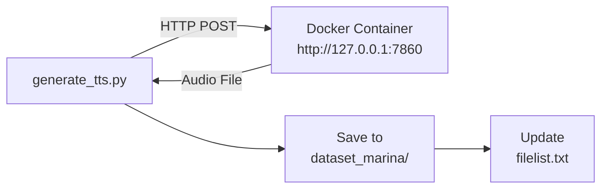

# Plan: Simple Local TTS Dataset Generation

## New Simple Approach - Use Local Docker Container

**Problem**: HuggingFace Space has quota limits and proxies don't work.

**Solution**: Use the StyleTTS2 model already running locally in Docker at `http://127.0.0.1:7860`.

## Configuration

```yaml
provider: styletts2
styletts2:
  api_url: http://127.0.0.1:7860
  model_name: multi
  voice: "Марина Панас"
  voice_en: ""
  speed: 1.3
```

## Architecture



## Implementation Steps

### Step 1: Create Simple TTS Client Script

Create `generate_tts.py` with:
- HTTP client to call local Gradio API
- Configuration from dict
- Audio saving logic
- Filelist updating

### Step 2: API Details

The Gradio API at `http://127.0.0.1:7860` expects:
- Endpoint: `/synthesize` (inferred from original code)
- Parameters:
  - `model_name`: "multi"
  - `text`: Ukrainian text
  - `speed`: 1.3
  - `voice_name`: "Марина Панас"

### Step 3: Simple Script Structure

```python
import requests
import os

API_URL = "http://127.0.0.1:7860/synthesize"

def generate_audio(text, output_path):
    response = requests.post(
        API_URL,
        json={
            "model_name": "multi",
            "text": text,
            "speed": 1.3,
            "voice_name": "Марина Панас"
        }
    )
    # Save audio from response
    with open(output_path, "wb") as f:
        f.write(response.content)

# Loop through sentences and generate
```

## Files to Create

| File | Purpose |
|------|---------|
| `generate_tts.py` | Simple TTS client for local Docker container |
| `requirements.txt` | Add `requests` dependency |

## Usage

```bash
# Ensure Docker container is running
docker run -p 7860:7860 styletts2-ukrainian

# Generate dataset
python generate_tts.py
```

## Advantages of This Approach

1. **No quota limits** - Local GPU is yours
2. **No proxies** - Direct local connection
3. **No network issues** - Everything on localhost
4. **Fast** - No network latency
5. **Simple** - Just HTTP requests to local API

## Success Criteria

- [ ] Script connects to local Docker container
- [ ] Audio files are generated correctly
- [ ] Filelist is updated with paths and text
- [ ] All 50 samples are generated